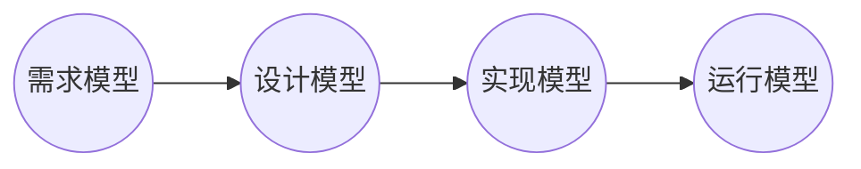
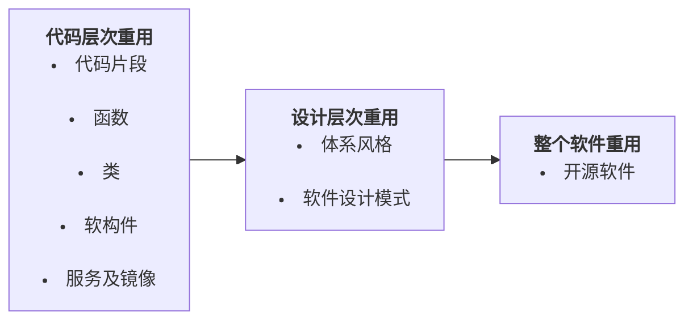

## 考点目录

| 一级知识点  | 二级知识点               |
| ------ | ------------------- |
| 软件工程概念 | 软件工程的概念、发展、目标和原则    |
| 软件危机   | 软件开发的特殊性、软件危机的表现和根源 |

## 软件工程概念

### 软件工程的概念

- 软件工程是一门研究如何用系统化、规范化、数量化等工程原则和方法进行软件开发和维护的学科
- 其目标是创造“足够好”的软件 
	- 低成本、高质量、按时交付 
- 其内容包括：市场调研、正式立项、需求分析、项目策划、概要设计、 详细设计、编程、测试、试运行、产品发布、用户培训、产品复制、 销售、实施、系统维护和版本升级等。 
- 软件工程不仅仅关注软件开发的技术过程，也关注软件项目管理以及支持软件开发的工具、方法和理论。
### 软件工程的发展

#### 发展史

略

#### 软件工程发展的技术特点

- 软件**抽象的层次**越来越高 
	- 二进制编码、结构化编程、结构化开发方法学、面向对象编程、面向对象开发方法学,…… 
- 软件**重用的粒度**越来越大 
	- 函数和过程，类，构件，开源软件，…… 
- **软件开发理念**的不断变化 
	- 以文档为中心与以代码为中心 
	- 从个体、团队到群体的开发组织 
	- 从还原论到演化论

### 软件工程的原则

(1) 用分阶段的生命周期计划严格管理 
(2) 坚持进行阶段评审
(3) 实行严格的产品控制 
(4) 用现代程序设计技术
(5) 结果应能清楚地审查
(6) 开发小组的人员应该少而精。
(7) 承认不断改进软件工程实践的必要性

- **抽象** 
- **模块化** 
- **封装** 
- **DRY** (Don't Repeat Yourself) 
- **KISS原则**（Keep It Simple, Stupid） 
- **YAGNI**（You Ain't Gonna Need It） 
- **SOLID** 原则
	- 单一职责原则、开闭原则、里氏替换原则、接口隔离原则、依赖倒置原则

#### 抽象和建模

**建模**：基于特定的抽象，借助于**建模语言**（如数据流图、UML 等），建立起基于这些抽象的**软件模型**，进而促进对软件系统的准确理解

#### 模块化

- 将软件系统的功能**分解**和实现为若干个模块，每个模块具有独**立的功能**，模块之间通过接口进行调用和访问。 
- **模块内部高内聚，模块间松耦合** 

#### 封装（信息隐藏）

- 模块内部信息（如内部的语句、变量等）**对外不可见或不可访问**，模块间仅仅交换那些为完成系统功能所必需交换的信息（如接口） 
- 模块设计时**只对外提供可见的接口**，不提供内部实现细节。信息隐藏原则可提升模块的独立性，减少错误向外传播，支持模块的并行开发

#### 软件重用

- 在软件开发过程中尽可能**利用已有的软件资源和资产**（如函数库、类库、构件库、开源软件、代码片段等）来实现软件系统 
- 努力开发出**可被再次重用**的软件资源（如函数、类、构件等） 
- 有助于提高软件开发效率，降低软件开发成本，满足开发工程约束，得到高质量的软件产品

##### 复用层次

### 软件工程的目标

创造“**足够好**”的软件 
- 满足功能性需求和非功能性需求（性能、可靠性、易用性、可维 护性、可扩展性等） 
- 低成本、高质量、按时交付（质量、进度、成本有不可能三角关系）

>课件外：付出较低开发成本；达到要求的功能；取得较好的性能；开发的软件易于移植；只需较低的维护费用；能按时完成开发任务，及时交付使用；开发的软件可靠性高。

## 软件危机

### 软件危机的表现

1. **成本**超出预算
	- 软件成本高，软硬件投资比发生急剧变化
2. **进度**经常延迟
	- 项目延期比比皆是 
	- 由于进度问题而取消的软件项目较常见 
	- 只有一小部分的项目能够按期完成
3. **质量**无法保证
	- 人总是会犯错误的 
	- 软件开发的错误表现为多种形式
	- 有些软件错误可能是致命的
4. 软件**维护**困难
	- 理解：读懂程序比较困难，尤其是他人程序 
	- 修改：程序非常脆弱，牵一发而动全身 
	- 出错：改了以后易引入错误 
	- 发现：有了错误后难以发现
5. 失败**风险**很大

### 软件危机的根源

- **软件复杂度高**
- **软件开发技术问题**
	- 过时的软件开发方法仍被沿用 
	- 设计、架构、测试等难题
- **组织管理问题**
	- 需求不清晰 
	- 进度不可控 
	- 沟通不畅
- **市场需求问题** 
	- 市场需求不断变化 
	- 软件需要快速适应 
	- 开发周期变短 
	- 开发成本变高
- **缺乏标准和规范** 
	- 缺乏标准化文档 
	- 缺乏标准化编码规范 
	- 缺乏标准化开发流程

